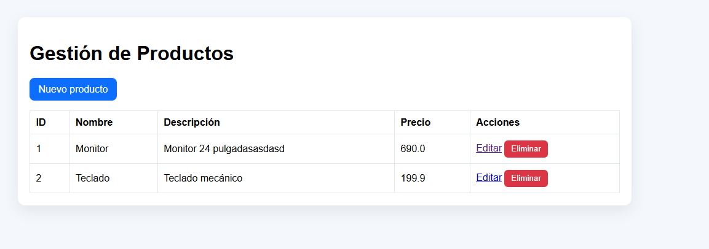
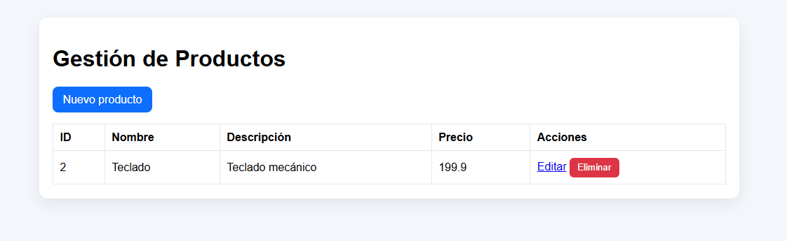
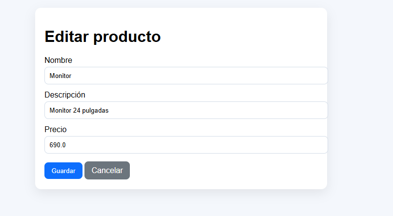
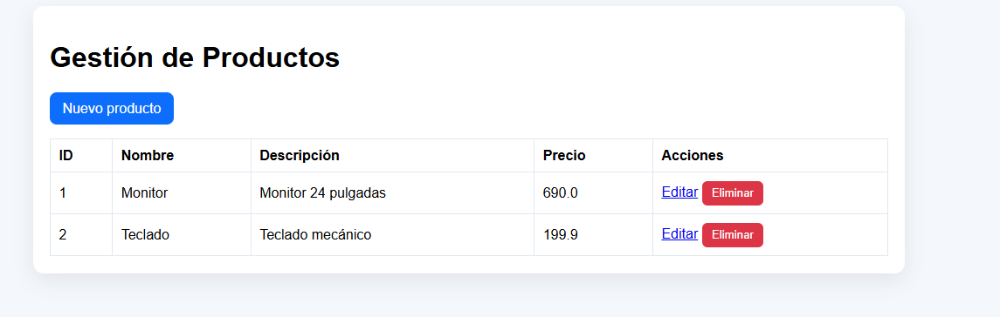
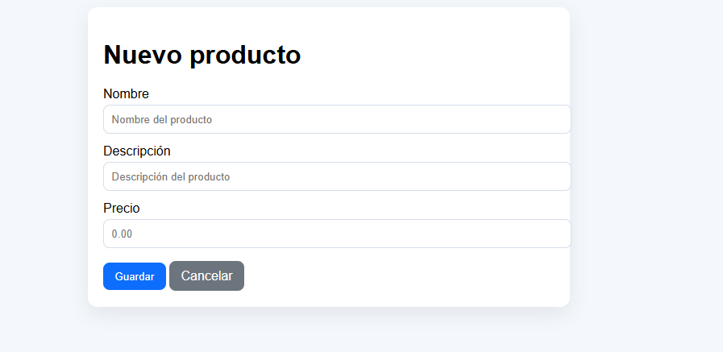

# daza-post1-u7

CRUD de productos con Spring Boot MVC + Thymeleaf y almacenamiento en memoria.

## Funcionalidades

- Listado en /productos
- Crear en /productos/nuevo
- Editar en /productos/editar/{id}
- Guardar con POST /productos/guardar
- Eliminar con POST /productos/eliminar/{id}
- Flujo Post/Redirect/Get

## Prerrequisitos

- JDK 17+
- Maven 3.8+

## Ejecución

1. mvn spring-boot:run
2. Abrir <http://localhost:8080/productos>

## Capturas







## Ejecución con Docker (Local)

1. Construir e iniciar contenedores:
   ```bash
   docker compose up -d --build
   ```
2. Verificar salud y acceso:
   - Estado: `http://localhost:8080/actuator/health`
   - Aplicación: `http://localhost:8080/productos`

## Despliegue en Railway

1. En Railway.app, crea un nuevo proyecto seleccionando "Deploy from GitHub repo".
2. Railway detectará el `Dockerfile` y construirá la imagen.
3. Agrega una base de datos: `New` -> `Database` -> `Add PostgreSQL`.
4. En tu servicio de la aplicación, ve a **Variables** y agrega:
   - `SPRING_PROFILES_ACTIVE=prod`
   - `DATABASE_URL=${{Postgres.DATABASE_URL}}`
   - `DB_USER=${{Postgres.PGUSER}}`
   - `DB_PASS=${{Postgres.PGPASSWORD}}`
5. Ve a **Settings** -> **Networking** -> **Generate Domain** para obtener la URL pública.
6. Verifica el despliegue visitando `https://[TU-DOMINIO].up.railway.app/actuator/health`.
